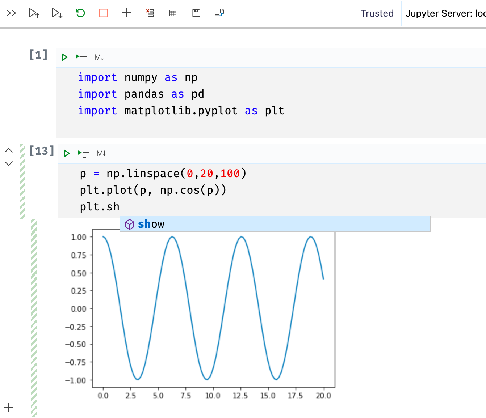

# VSCode で Jupyter を綺麗に動かして、数学の勉強が楽しくなる環境を作りたい。

## きっかけ

- 数学の教科書をひとりでずっと読んでいると心が折れがちなので、何か数学が動いている様を見られたら元気が出るのではないだろうか。
- 自分のMacに最初から入っていたPython(2系)や、その後いろいろ試行錯誤したpyenvや、それらとVSCodeから選ぶインタープリターやら何やらがいつもなんだかうまくいったりいかなかったりするので、それをどこかに落ちつけたい。
- 綺麗に再現できる環境で、自分が好きな Visual Studio Code が使えたらいいな。

## JupyterのDockerイメージを使ってみることにした。

[Jupyter Docker Stacks](https://github.com/jupyter/docker-stacks)を参考に、いろいろ入ってそうな**datascience-notebook**というイメージを使えば、ライブラリの追加とかしなくても、一通りのことができるのではないかと思った。他にも[Selecting an Image](https://jupyter-docker-stacks.readthedocs.io/en/latest/using/selecting.html)というところに、いろいろイメージはある。

## VSCodeのRemote Containerを使ってみることにした。

- [Remote Containersの拡張機能](https://marketplace.visualstudio.com/items?itemName=ms-vscode-remote.remote-containers)を入れる。これによりプロジェクトをコンテナ内で開けるようになる。
- Remote Containers以外の拡張機能は、開いた先のコンテナ内のVSCodeで使うものを`devcontainer.json`に定義できるので、そちらに記述する。このREADMEを書いている時点では、pythonとjupyterを入れてみている。
- この使い方で合っているのか分からないが、`docker-compose`で、プロジェクトフォルダ自体を`volume`として使うようにしていて、`.vscode`以下とかも全部、Remote側での変更が保存されるようにしているつもり。（ `settings.json` に書いてある python のパスとか ）
- この状態（ Remote Containersの機能拡張が入って、各種設定ファイルを置いた状態 ）でプロジェクトを開くと「Open in Container?」みたい確認ダイアログが出る（または手動でも左下の >< みたいなボタンから開ける）ので、開くとRemote側のVSCodeが起動する。

## Hello Jupyter Notebook in Remote Container

`numpy`や`matplotlib`などの使いそうなライブラリが使えて、コード補完やグラフ描画などもなんとなくはできていそうな感じ🎉



`docker ps`を見てみると、たしかにContainerで動いているようである。なんだか不思議な気持ち。

```shell
❯ docker ps
CONTAINER ID        IMAGE                          COMMAND                  CREATED             STATUS              PORTS                    NAMES
e1556a11cc0b        jupyter/datascience-notebook   "tini -g -- start-no…"   4 minutes ago       Up 4 minutes        0.0.0.0:8888->8888/tcp   jupyter-notebook-in-remote-container_devcontainer_jupyter_1
```

